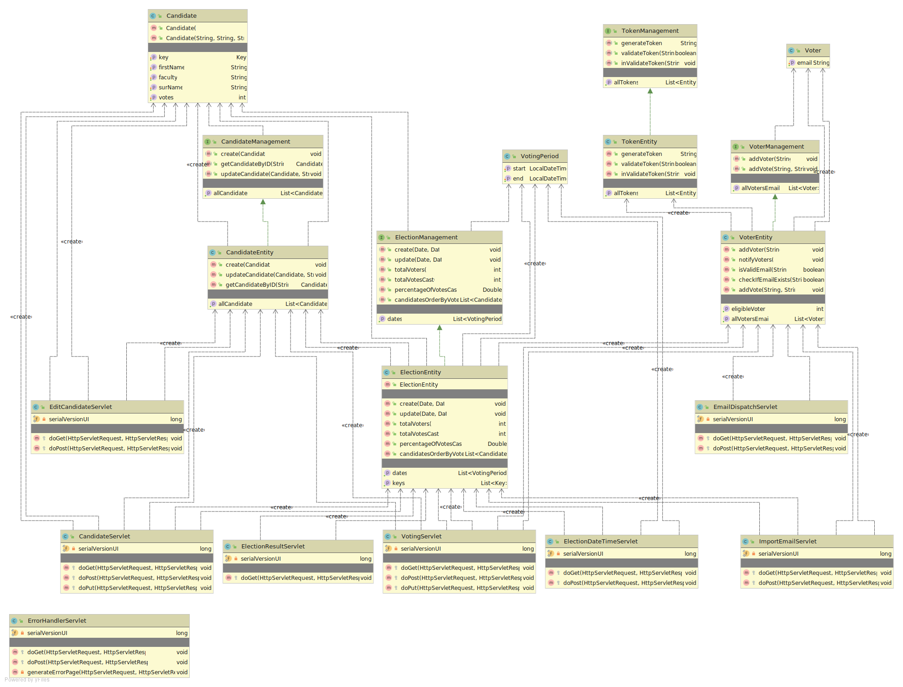

UniversityElection using Google AppEngine
============================

#### Prerequisites
* [Java 8](http://www.oracle.com/technetwork/java/javase/downloads/index.html)
* [Maven](https://maven.apache.org/download.cgi) (at least 3.5)
* [Gradle](https://gradle.org/gradle-download/) (optional)
* [Google Cloud SDK](https://cloud.google.com/sdk/) (aka gcloud)
    * has to be initialized before using (`gcloud init`) (See the [Google App Engine documentation](https://cloud.google.com/appengine/docs/java/) for more detailed instructions.)

#### How to run
Using the following command, the project gets deployed locally and is usable under [http://localhost:8080/](http://localhost:8080/)

    gradle appengineStart or gradle appengineRun

The corresponding admin page can be found under [http://localhost:8080/_ah/admin](http://localhost:8080/_ah/admin).

To stop the server the command `gradle appengineStop` can be used.

To deploy the system to google appengine the command `gradle appengineDeploy` can be used. The system can be accessed using this link [https://e-voting-system-263812.appspot.com/](https://e-voting-system-263812.appspot.com/)

#### Interface
Opening the frontend, the user has to sign in to check for admin rights and thus prevent unauthorized people changing attributes of the election.
If the user is not signed in as administrator, only the voting page can be accessed, else the page shows the following options:
- **Candidates** (`./admin/candidates`)  
Showing an overview of all current candidates (name, surname, faculty) with the possibility of adding candidates, if the election hasn't started yet (in this time period added candidates can also be edited).  
*Restrictions:* None of the attributes of a candidate can be empty or null.
- **Set Election Period** (`-/admin/setdate`)  
Used to select the period of time where all authorized persons can choose their candidate. Using the `bootstrap-datetimepicker`, the selection of a date and time is easy and checking the given values in the frontend is simplified. If an election date was already selected, an alert is shown, that editing the period will overwrite the old one.   
*Restrictions:* The start date cannot be before now, the end date cannot be before the start date or now
- **Voters** (`./admin/voters`)  
Showing an overview of all email addresses of eligible voters, they can be added by uploading a file with the email addresses. Like with candidates, adding voters is only possible before the election.
- **Token**
Token is an independent entity. The generated tokens are used only once and after using it is invalidated. 

The only two page accessible for voters are:
- **Voting Page** (`./voting`)
Here once an election is started all voters can select their candidate and with a valid token the vote gets saved. If an election period is already set, the start date is being shown, as well as during the election the end date is shown. This page can not be accessed from the main page. The Voters gets the URL for the page using email. 
- **Election Results** (`./result`)  
Once the election is over, the results can be seen on this page. In the top table, the number of eligible voters, the number of actual votes and the turnout are presented. The next table shows the candidates ordered by the number of received votes. The last part on the page shows a pie chart (using [highcharts](https://www.highcharts.com/)) displaying the election result in another format.

In the frontend as well as in the backend all inputs are getting checked and validated. In the frontend that happens mostly with adding the `required`-parameter to inputs. In the backend, if one of the restrictions is triggered or another internal error happens, an error get propagated to the `ErrorHandlerServlet` which displays the error as well as other information (like code, class, requesturi and the throwing servletname).

#### Entity-Relationship Diagram

